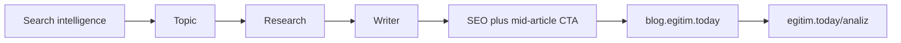

# CS-GROWTH-02 — Shadow funnel content pipeline

Issue: [content-studio#109](https://github.com/metinbagdat/content-studio/issues/109)

Demand path: search intent article on `blog.egitim.today` → diagnostic CTA on `https://egitim.today/analiz`.  
Writer stays in Content Studio. LearnCon owns the diagnostic. No second factory.

## Pipeline

Publish bridge after draft approval: wp-seo-hub (Safe SamurAI). LearnCon P6 (`POST /api/growth/content-published`, #1568) records the published URL. This doc does not add a new webhook.

## Article template

Canonical CTA (only this URL in the body CTA):

`https://egitim.today/analiz?utm_source=learning_center&utm_medium=cta&utm_campaign=shadow_funnel`

| Block | Job |
|-------|-----|
| Problem | Name the exam pain in the first 80 words. No product pitch. |
| Raise | One concrete method (plan, error log, or weekly loop). |
| CTA | One sentence + the canonical `/analiz` link. Mid-article, not only the footer. |
| Close | What changes after the diagnostic. No second competing CTA. |

## Pilot brief (no production run required)

| Field | Value |
|-------|--------|
| slug | `tyt-matematik-hata-defteri` |
| intent | Student keeps missing the same TYT math topics |
| cluster | TYT / calisma |
| CTA | canonical `/analiz` URL above |
| status | brief only — do not auto-publish |

Outline:

1. Problem: repeating the same three error types.
2. Raise: a 7-day error-log loop (topic, mistake, one retry set).
3. CTA: two-minute diagnostic on egitim.today.
4. Close: the log becomes the next week's plan.
